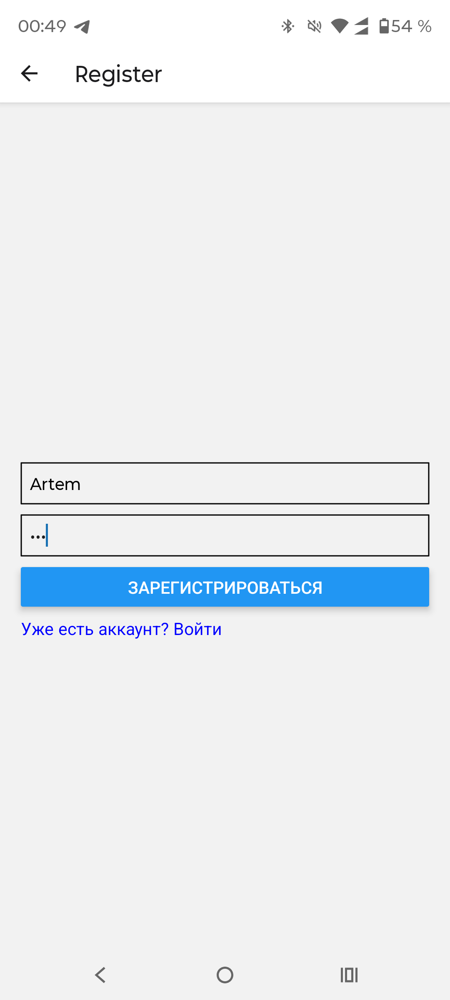
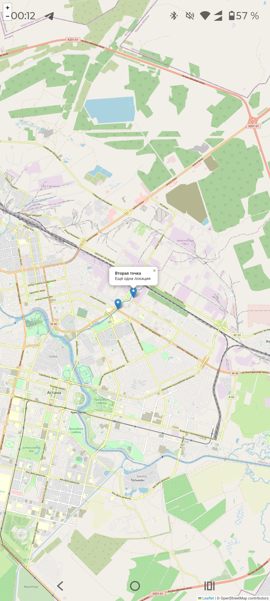

# GIS Demo - React Native + Leaflet + Express

Простой проект для демонстрации работы с картами в мобильных приложениях через **React Native WebView**, **Leaflet** и **REST API**.

---

## Структура проекта

```
gis-demo/
├─ backend/       # Node.js + Express API
├─ web/           # Leaflet карта
├─ mobile/        # React Native приложение
├─ screenshots/   # Скриншоты с телефона
├─ .gitignore
└─ README.md
```

---

## Backend

* Node.js + Express
* REST API: `/api/points` возвращает точки в формате GeoJSON

Запуск:

```bash
cd backend
node index.js
```

API доступен на:

```
http://<IP_ПК>:3000/api/points
```

Пример ответа:

```json
{
  "type": "FeatureCollection",
  "features": [
    {
      "type": "Feature",
      "properties": {
        "title": "Центр Астаны",
        "description": "Первая точка"
      },
      "geometry": {
        "type": "Point",
        "coordinates": [71.4704, 51.1605]
      }
    },
    {
      "type": "Feature",
      "properties": {
        "title": "Вторая точка",
        "description": "Ещё одна локация"
      },
      "geometry": {
        "type": "Point",
        "coordinates": [71.4800, 51.1650]
      }
    }
  ]
}
```

---

## Web (Leaflet карта)

* Leaflet + OpenStreetMap
* Загружает точки с бекенда
* Popup с названием и описанием

Запуск:

```bash
cd web
npx http-server -p 8080
```

Карта доступна на:

```
http://<IP_ПК>:8080/map.html
```

Пример fetch для точек:

```js
fetch('http://<IP_ПК>:3000/api/points')
  .then(res => res.json())
  .then(data => {
    L.geoJSON(data, {
      onEachFeature: (feature, layer) => {
        layer.bindPopup(
          `<strong>${feature.properties.title}</strong><br/>
           ${feature.properties.description}`
        );
      }
    }).addTo(map);
  });
```

---

## Mobile (React Native + WebView)

* Expo + WebView
* Загружает web карту с backend

`App.js` пример:

```js
import { View } from 'react-native';
import { WebView } from 'react-native-webview';

export default function App() {
  return (
    <View style={{ flex: 1 }}>
      <WebView
        source={{ uri: 'http://<IP_ПК>:8080/map.html' }}
        javaScriptEnabled
      />
    </View>
  );
}
```

Запуск:

```bash
cd mobile
npx expo start
```

* Сканируй QR код в Expo Go
* Или запускай на эмуляторе (`a` для Android, `i` для iOS)

---

## Скринов с телефона

> Скриншот экранов регистрации и карты на мобильном устройстве:




---

## Примечания

* Всегда использовать **IP компьютера**, а не `localhost`, чтобы WebView и fetch работали на телефоне
* Все зависимости указаны в `package.json`
* `.gitignore` настроен для `node_modules`, Expo, IDE и env-файлов
* Проект полностью рабочий: **карта на мобильном с точками из backend**

---
